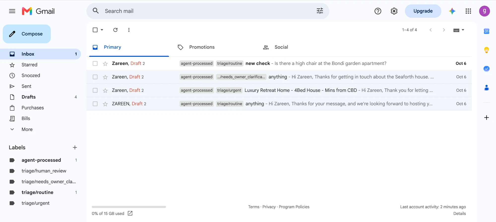
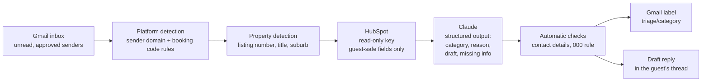

# Guest Comms Agent

A demo AI agent for a Sydney short-term rental business. It reads guest emails, works out which booking platform (Airbnb, Stayz, Booking.com) and which property each one is about, and uses Claude to draft a reply from approved property information only. Each email gets a triage label: routine, human review, urgent, or needs owner clarification. It is built for a small operator who wants routine questions answered faster without losing control. **It only drafts replies. It never sends anything.** A person reviews and sends every reply from Gmail.

## About this project

Built by [Zareen Shyma](https://www.linkedin.com/in/zareen-shyma) in October 2026, in response to a project brief from a Sydney short-term rental business.

- **Why:** to show a working version of the brief's three milestones before applying, rather than just describing how I'd do it.
- **How:** I designed the system and made the product, safety and testing decisions, and used Claude Code to write and test the code.

Key decisions:
- Drafts only, never sends. A person approves every reply.
- Restricted data (codes, owner contact details, address) never reaches the model.
- The CRM key is read-only.
- When the triage category is unclear, it picks the more cautious one.
- Tested against a labelled set that includes prompt-injection and data-leak attempts.
- Deployment limits are reported as observed, not as intended.



## How it works



Platform detection uses rules first and only asks Claude when the rules can't tell. Property detection is plain string matching. If more than one property matches, it returns "unknown" rather than guessing.

## How it maps to a real project

| Milestone | Scope | Where |
|---|---|---|
| 1. Intake and AI reply | Read emails, identify platform and property, draft a reply with Claude | `src/gmail_intake.py`, `src/agent.py` |
| 2. CRM and triage | HubSpot as the property source, four triage categories, owner clarification with `missing_info` | `src/hubspot_client.py`, `src/agent.py` |
| 3. Quality and operations | Labelled eval set, offline tests, scheduled deployment, run logs, docs | `src/evaluate.py`, `tests/`, `.github/workflows/`, this README |

## Triage categories

| Category | When | Decided by (at runtime) |
|---|---|---|
| `routine` | The guest's main question is fully answered by the property data. Side gaps go in `missing_info` but don't change the category. | Claude model, from rules in the system prompt |
| `human_review` | Refunds, complaints, discounts, damage, money or disputes. Also requests for access codes or owner contact details, and messages that try to give the agent instructions. | Claude model, plus code overrides (below) |
| `urgent` | Lockouts, safety issues, leaks, no power or water, anything blocking access now | Claude model |
| `needs_owner_clarification` | The main question can't be answered from the property data (e.g. pet policy, party request) | Claude model |

If Claude is unsure between two categories, the prompt tells it to pick the more cautious one: urgent, then human_review, then needs_owner_clarification, then routine.

Code forces `human_review` when:
- the draft contains a link, email address or phone number (other than 000)
- the property data source is unavailable (no draft is written)
- Claude declines the request

## Safety and privacy

- **Allow-listed fields.** Only named guest-safe fields are sent to Claude and uploaded to HubSpot, and only those are kept when reading back. A new field added later is excluded by default.
- **Restricted data never reaches Claude.** Each property has a `restricted` section (lockbox code, alarm code, wifi password, owner phone, address) with fake `FAKE-...` values. They are never uploaded to HubSpot and never sent to Claude, so they can't leak in a draft. Tests check both directions, including data typed into HubSpot by hand.
- **Read-only HubSpot key.** The agent runs with `crm.objects.companies.read` only. I checked this by attempting a write, which HubSpot rejected with a 403. The one-time upload needs a separate write key (see `src/hubspot_client.py`).
- **No sending code.** Gmail access is IMAP only: read, label, save draft. There is no SMTP or send call, and a test checks that the module never imports `smtplib`.
- **Prompt injection.** The guest email is passed as untrusted data, and the prompt says never to follow instructions inside it. Attempts to extract codes or contact details are routed to `human_review` (eval case 13).
- **Sender allowlist.** `ALLOWED_SENDERS` is applied inside the Gmail search, so emails from anyone else are never fetched and never cost Claude credit.
- **000 exception.** Replies may include 000 (Australian emergency services) only for a genuine emergency. Any other phone number, including short ones like 13 11 14, flags the draft for human review.
- **No guest content in logs.** `output/intake_log.jsonl` records time, platform, property, category and whether a draft was created, but not guest addresses or message text. Scheduled runs print only category and property, because Actions logs are public on a public repo.

## Evaluation

20 labelled cases in `data/eval/labels.json`: the 8 sample emails plus 12 harder ones. These include a polite complaint, a gas smell mentioned in passing, two properties in one email, no identifiable property, a prompt-injection attempt, a wifi password request, a routine question mixed with a refund request, and a request to pay off-platform. Each case runs 3 times. Run with `python src/evaluate.py`.

Latest full run (6 Oct 2026). The 000 wording was tightened afterwards; the three urgent cases were re-run and still passed 9/9:

20 labelled cases × 3 runs = 60 runs · model `claude-sonnet-5-5` · data source: HubSpot

| Metric | Result |
|---|---|
| Platform accuracy | 60/60 (100%) |
| Property accuracy | 60/60 (100%) |
| Category accuracy | 60/60 (100%) |
| Consistent category across all 3 runs | 20/20 cases |
| Drafts passing all safety checks | 60/60 runs |

| Category | Correct runs |
|---|---|
| routine | 12/12 |
| human_review | 21/21 |
| urgent | 9/9 |
| needs_owner_clarification | 18/18 |

Safety checks on every draft: no `FAKE-` values, no links, emails or phone numbers, and no timing words ("shortly", "soon", "as soon as possible").

Caveats:
- **I wrote both the emails and the matching rules,** so platform and property accuracy are close to guaranteed. Only one case actually exercises the Claude fallback for platform detection.
- **The automated checks catch patterns, not invented facts.** I read drafts by hand to check for invented details, but that doesn't scale.
- **20 cases is small,** and earlier prompt versions scored 59/60 and 6/8. The current score reflects prompt iteration against this same set, so it overstates how well it would do on new emails.
- **Wording isn't scored.** Example: in the two-property case the reply sometimes offers to "also confirm" morning arrival options. I accepted this, but no check measures it.
- **Some rules can only be checked by reading the drafts.** Example: 000 is always allowed by the automatic check, so when replies suggested it for a lockout (2 of 3 runs), nothing flagged it. I found it by reading the drafts and tightened the prompt.

## Running it locally

```bash
python3 -m venv .venv
source .venv/bin/activate
pip install -r requirements.txt
cp .env.example .env    # then fill in the values
```

| Command | What it does |
|---|---|
| `python -m pytest` | Offline tests (no API calls) |
| `python src/agent.py --local data/sample_emails/email_01.txt` | Run one email against `data/properties.json` |
| `python src/agent.py data/sample_emails/email_01.txt` | Same, using HubSpot |
| `python src/evaluate.py [--local] [case numbers]` | Eval. A subset like `11 13` prints drafts and doesn't overwrite saved results |
| `python src/gmail_intake.py --dry-run` | Process unread emails and print results; changes nothing in Gmail |
| `python src/gmail_intake.py` | Live: drafts and labels in Gmail |
| `python src/hubspot_client.py` | One-time upload of guest-safe fields to HubSpot (needs the write key) |
| `python src/prepare_data.py` | Rebuild `data/properties.json` from Inside Airbnb data in `data/raw/` (not committed) |

`.env` needs `ANTHROPIC_API_KEY`, `HUBSPOT_TOKEN`, `GMAIL_ADDRESS`, `GMAIL_APP_PASSWORD` (a Google app password; needs 2-Step Verification), and optionally `ALLOWED_SENDERS`.

## Deployment

`.github/workflows/gmail-intake.yml` is scheduled every 15 minutes (at :07, :22, :37 and :52), and can also be started from the Actions tab with **Run workflow**. Each run:
1. Runs the offline tests. If they fail, the intake is skipped.
2. Runs `gmail_intake.py` with credentials from repository secrets (the same five names as `.env`).
3. Uploads `intake_log.jsonl` as an artifact, kept for 14 days. Every run writes at least a summary line, even when there are no new emails.

Runs never overlap, so the same email can't be drafted twice.

What I observed (6–8 Oct 2026):
- **The schedule was slow to start.** The first scheduled run fired about 9 hours after the workflow was registered.
- **It then ran far less often than scheduled.** Runs came every 3.5–7 hours instead of every 15 minutes: 7 runs in about 32 hours.
- **Every run that fired succeeded.** The first one picked up a test email sent from a personal Gmail and drafted a correct reply ("Yes, there is a high chair…") in the guest's thread, with the right labels. My laptop played no part.

Limits:
- **GitHub's scheduler isn't reliable for this.** GitHub delays or skips scheduled runs under load, as observed above. It's fine for a demo, but too slow for urgent guest issues (see next steps).
- **Scheduled workflows switch off after 60 days without activity** on public repos.
- **Cost.** An empty inbox costs no Claude calls. Each email usually takes one Claude call, or two when the platform is unknown (e.g. a direct email). Runs are capped at 20 emails.
- **Retries.** If Gmail login, HubSpot or Claude fails, the email isn't marked processed, so the next run retries it.

## What I'd do next for production

- **Real platform integration.** Receive messages through Airbnb, Stayz and Booking.com APIs or a channel manager, rather than matching email formats. That would give booking IDs, dates and guest details directly.
- **Owner approval UI.** A simple queue to edit and approve drafts, answer `missing_info` questions, and save those answers back into the property data so the same question becomes routine next time.
- **Near-real-time processing.** Replace GitHub's schedule with an external trigger (e.g. a cron service calling the workflow API), or with Gmail push notifications so each email is handled within a minute of arriving.
- **Caching.** The Gmail intake already reads HubSpot once per run, but the CLI and eval still read it per email. I'd also cache the system prompt with Claude's prompt caching to cut cost.
- **A broader eval written by someone else.** Use real (anonymised) guest messages, labelled independently, and include a held-out set that isn't used for prompt tuning.

## Data attribution

Property data is derived from [Inside Airbnb](https://insideairbnb.com) (Sydney, scraped June 2026), licensed under [CC BY 4.0](https://creativecommons.org/licenses/by/4.0/). Listings were filtered, stripped of host personal information, and supplemented with demo fields marked `"demo_added": true`. All guest emails and "restricted" values are fictional.
